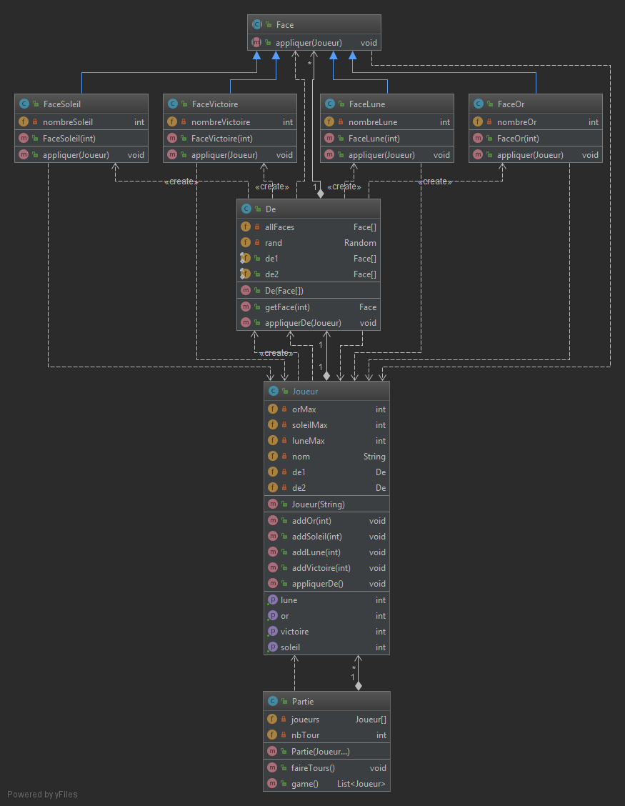

# Class :

* Face est une classe abstraite qui représente tous les types de faces de notre dé, elle est pourvue de la méthode 
void appliquer(Joueur J) qui prend un joueur et modifie ses ressources en fonction de son effet propre. 
Ensuite chacune de ses sous-classes implémente cette méthode.
* FaceVictoire est la face qui représente les faces points de victoires
* FaceSoleil est la face qui représente les faces des ressources Solaires
* FaceLune est la face qui représente les faces des ressources Lunes
* FaceOr est la face qui représente les faces des ressources Or
* De possède un tableau de Face et est pourvu de la méthode 
appliquerDe(Joueur j) : 
  * prend un joueur, choisit une face aléatoirement et l'applique à ce joueur.
* Partie est une classe qui possède le tableau des Joueurs dans cette partie, elle peut effectuer des tours avec la fonction :
void faireTours() :
  * effectue un tour de jeu pour chaque joueur (pour l'instant le tour de jeu est limité à un lancer de dé).

  * Et une partie complète avec List<Joueur> game() qui simule une partie d'un nombre de tour déterminé par le nombre de joueur, et renvoie la liste de(s) gagnant(s).

# Test :
* Les tests unitaires de chaque classe ont été effectué par une personne différente de celle qui l'a développée.
