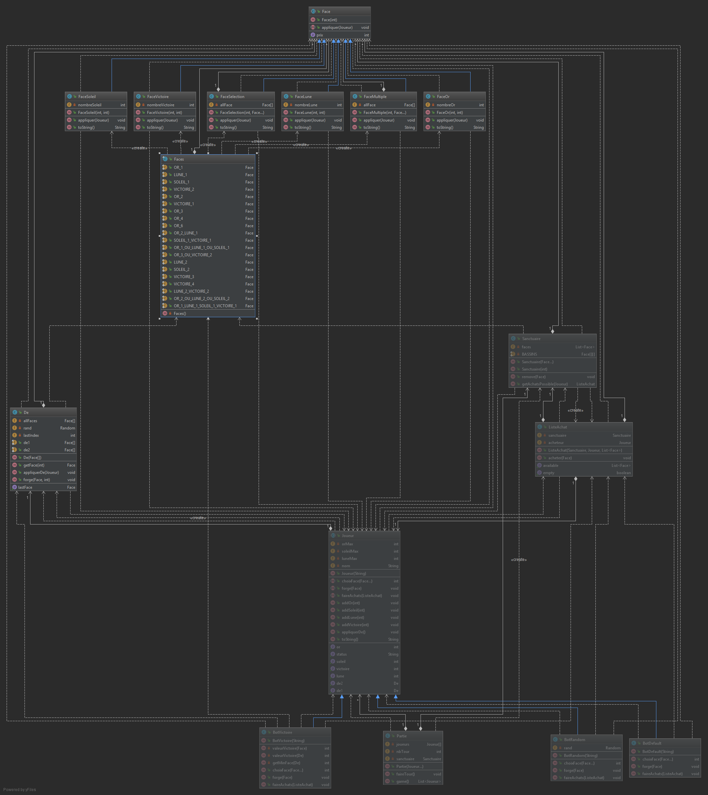

# Bilan itération 2

Nous avions prévu de réaliser les tâches suivantes :

* Sanctuaire : Pour acheter les faces.

* Donner un prix en or aux faces.

* Faces du sanctuaire qui donnent plusieurs ressources à la fois (face multiple).

* Faces du sanctuaire où le joueur a le choix entre plusieurs choix de ressource.

* Montrer le déroulé de la partie plus explicitement comme demandé dans le feedback.

* Bot de base pour faire les achats et pour choisir les faces dans le sanctuaire.
  * bot default : pour les tests ayant besoin de joueurs mais pas d'un bot complet.
  * bot random : fait des décisions de manière aléatoire.
  * bot victoire : cherche à maximiser les points de victoires sur ses dés.

Toutes les taches ont été accomplies.

Pour les tests :

* Test des nouvelles faces.
* Test du sanctuaire.
* Test de bot victoire pour s'assurer qu'il fonctionnne. 

Nous n'avons pas testé bot default car ses méthodes sont vides ainsi que bot random car il fait des choix aléatoires.
Bot random a pour uniques fonctions d'essayer notre système de bot et d'être comparé en pratique à bot victoire.

# Diagramme de classes de l'itération

