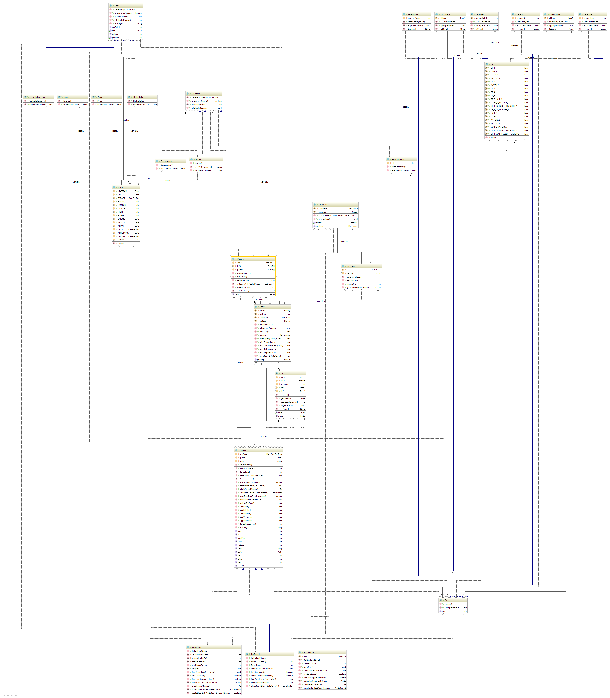

# Bilan itération 4

Nous avions prévu de réaliser les tâches suivantes :
* Les cartes à effets simples :
  * Le coffre du Forgeron 
  * Les Herbes Folles
  * La Pince 
  * L'Enigme
* Les Cartes Renforts :
  * Les Sabots d'Argent 
  * Les ailes de la Gardienne
  * L'Ancien 
* Séparation logique d'affichage et de jeu

Toutes les tâches ont été accomplies.

Pour les tests : 
* Test cartes à effets simples
* Test cartes renforts 

Néanmoins nous n'avons pas eu le temps de mettre à jour entièrement les tests des bots et du joueur.

# Diagrammes de l'itération 

Diagramme de classe

