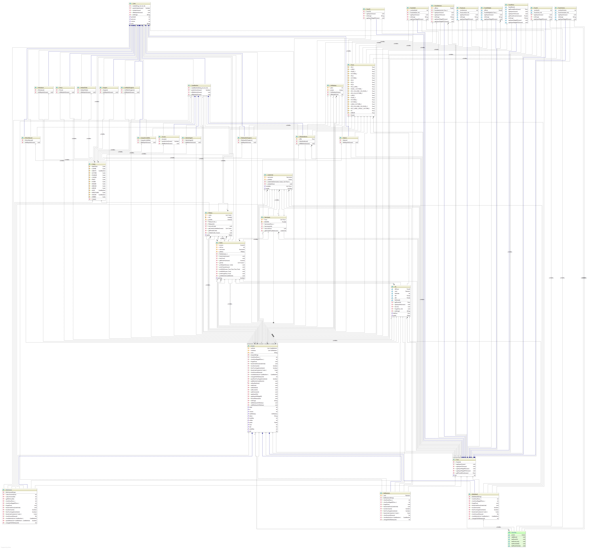

# Bilan itération 5

Nous avions prévu de réaliser les tâches suivantes :
* Réaliser le reste des cartes de l'édition de base :
  * Le Minotaure
  * Les Satyres
  * Le Casque d'invisibilité
  * Le Miroir Abyssal

Toutes les tâches ont été accomplies.

Pour les tests : 
* Tester les nouvelles cartes qui ont été ajoutées
* Faire les tests en retard pour les bots et le joueur

Ces tests ont tous été réalisés.

# Diagrammes de l'itération 

Diagramme de classe

